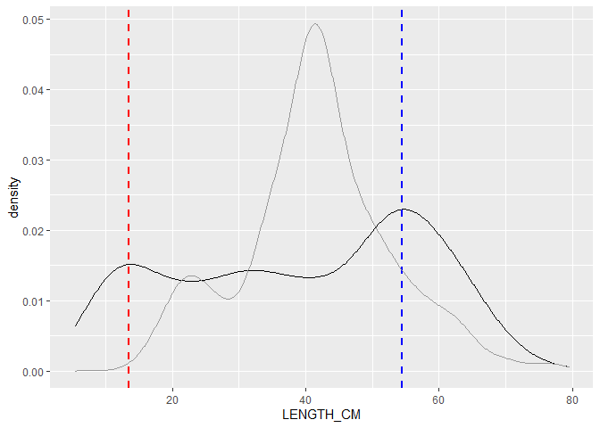
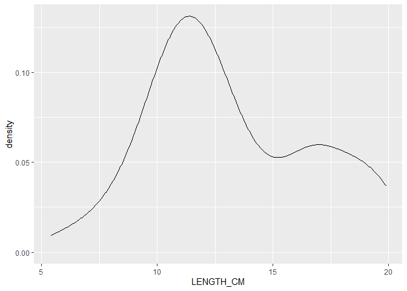
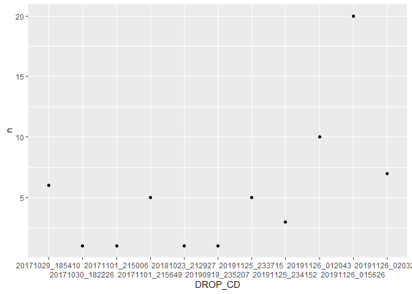
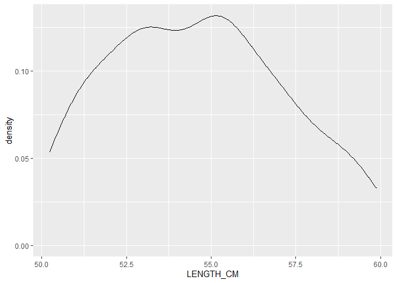
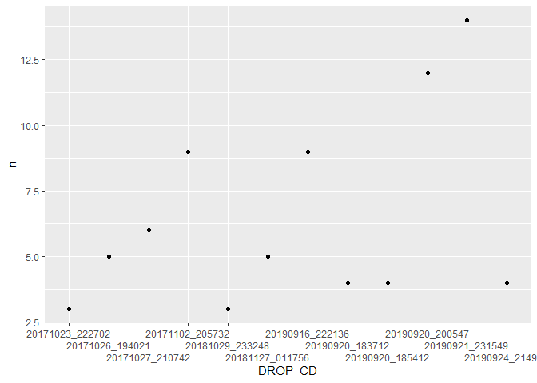
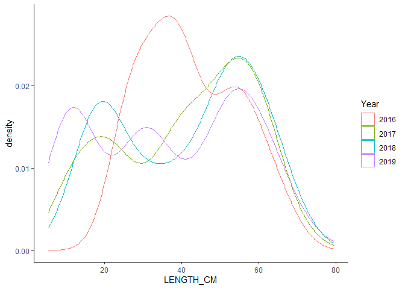
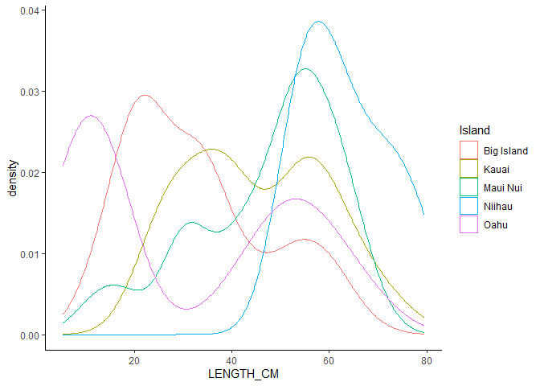
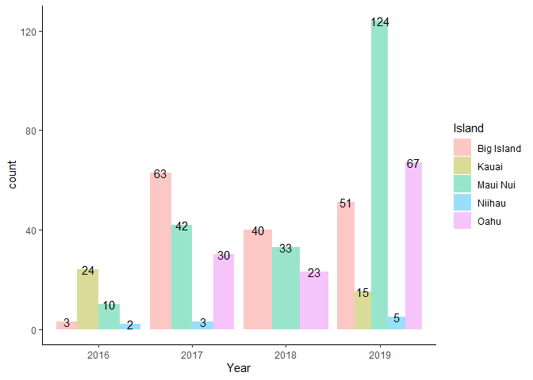
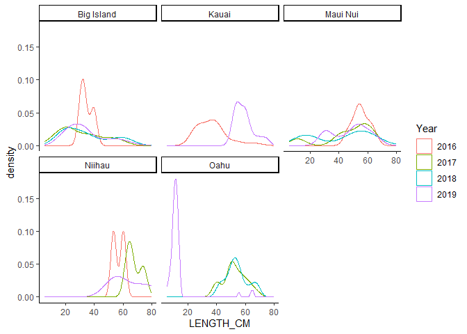
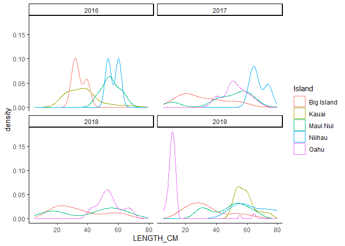

BFISH Length Comp Investigations
================
Meg Oshima
5/21/2021

## Camera Lengths

    ##        X              PSU          DROP_CD           SPECIES_CD       
    ##  Min.   :  1.0   Min.   :   18   Length:976         Length:976        
    ##  1st Qu.:244.8   1st Qu.: 8961   Class :character   Class :character  
    ##  Median :488.5   Median :23017   Mode  :character   Mode  :character  
    ##  Mean   :488.5   Mean   :21961                                        
    ##  3rd Qu.:732.2   3rd Qu.:35943                                        
    ##  Max.   :976.0   Max.   :45499                                        
    ##  SCIENTIFIC_NAME    COMMON_NAME           BFISH           OFFICIAL_DEPTH_M
    ##  Length:976         Length:976         Length:976         Min.   : 77.16  
    ##  Class :character   Class :character   Class :character   1st Qu.:114.76  
    ##  Mode  :character   Mode  :character   Mode  :character   Median :152.00  
    ##                                                           Mean   :155.41  
    ##                                                           3rd Qu.:192.00  
    ##                                                           Max.   :274.00  
    ##    LENGTH_CM         Island         
    ##  Min.   :  5.40   Length:976        
    ##  1st Qu.: 25.73   Class :character  
    ##  Median : 37.34   Mode  :character  
    ##  Mean   : 38.30                     
    ##  3rd Qu.: 51.73                     
    ##  Max.   :111.60

    ## Warning: Removed 1 rows containing non-finite values (stat_density).

<!-- -->

#### What is causing the mode in the smaller size classes in the BFISH camera data?

-   Which sites are most of these samples coming from?
-   Which islands are these samples from?  
-   What depth are these samples from?

<!-- --><!-- -->

#### Sites that caught 5 or more fish less than 20cm

<table class="gt_table">
  
  <thead class="gt_col_headings">
    <tr>
      <th class="gt_col_heading gt_columns_bottom_border gt_left" rowspan="1" colspan="1">DROP_CD</th>
      <th class="gt_col_heading gt_columns_bottom_border gt_center" rowspan="1" colspan="1">n</th>
    </tr>
  </thead>
  <tbody class="gt_table_body">
    <tr>
      <td class="gt_row gt_left">20191126_015626</td>
      <td class="gt_row gt_center">20</td>
    </tr>
    <tr>
      <td class="gt_row gt_left">20191126_012043</td>
      <td class="gt_row gt_center">12</td>
    </tr>
    <tr>
      <td class="gt_row gt_left">20171029_185410</td>
      <td class="gt_row gt_center">7</td>
    </tr>
    <tr>
      <td class="gt_row gt_left">20191126_020320</td>
      <td class="gt_row gt_center">7</td>
    </tr>
    <tr>
      <td class="gt_row gt_left">20191125_233715</td>
      <td class="gt_row gt_center">6</td>
    </tr>
    <tr>
      <td class="gt_row gt_left">20171101_215649</td>
      <td class="gt_row gt_center">5</td>
    </tr>
  </tbody>
  
  
</table>

#### What is causing the mode in the larger size classes in the BFISH camera data?

-   Which sites are most of these samples coming from?
-   Which islands are these samples from?  
-   What depth are these samples from?

<!-- --><!-- -->

#### Sites that caught more than 5 fish between 50 and 60 cm

<table class="gt_table">
  
  <thead class="gt_col_headings">
    <tr>
      <th class="gt_col_heading gt_columns_bottom_border gt_left" rowspan="1" colspan="1">DROP_CD</th>
      <th class="gt_col_heading gt_columns_bottom_border gt_center" rowspan="1" colspan="1">n</th>
    </tr>
  </thead>
  <tbody class="gt_table_body">
    <tr>
      <td class="gt_row gt_left">20190921_231549</td>
      <td class="gt_row gt_center">14</td>
    </tr>
    <tr>
      <td class="gt_row gt_left">20190920_200547</td>
      <td class="gt_row gt_center">12</td>
    </tr>
    <tr>
      <td class="gt_row gt_left">20171102_205732</td>
      <td class="gt_row gt_center">9</td>
    </tr>
    <tr>
      <td class="gt_row gt_left">20190916_222136</td>
      <td class="gt_row gt_center">9</td>
    </tr>
    <tr>
      <td class="gt_row gt_left">20171027_210742</td>
      <td class="gt_row gt_center">6</td>
    </tr>
  </tbody>
  
  
</table>

## Fishing Lengths

    ##       PSU         SAMPLE_ID          SPECIES_CD        SCIENTIFIC_NAME   
    ##  Min.   :  271   Length:293         Length:293         Length:293        
    ##  1st Qu.:11839   Class :character   Class :character   Class :character  
    ##  Median :16916   Mode  :character   Mode  :character   Mode  :character  
    ##  Mean   :19741                                                           
    ##  3rd Qu.:32422                                                           
    ##  Max.   :43397                                                           
    ##                                                                          
    ##  COMMON_NAME          LENGTH_CM       WEIGHT_LB        BFISH          
    ##  Length:293         Min.   :16.00   Min.   :0.000   Length:293        
    ##  Class :character   1st Qu.:35.50   1st Qu.:1.408   Class :character  
    ##  Mode  :character   Median :41.50   Median :2.546   Mode  :character  
    ##                     Mean   :41.54   Mean   :3.300                     
    ##                     3rd Qu.:48.00   3rd Qu.:4.877                     
    ##                     Max.   :77.00   Max.   :9.900                     
    ##                     NA's   :1       NA's   :253                       
    ##  SAMPLE_MEAN_DEPTH_M    Island         
    ##  Min.   : 79.0       Length:293        
    ##  1st Qu.:116.0       Class :character  
    ##  Median :137.0       Mode  :character  
    ##  Mean   :139.3                         
    ##  3rd Qu.:158.0                         
    ##  Max.   :260.0                         
    ## 

#### Sites that caught more than 1 fish between 20 and 25 cm

<table class="gt_table">
  
  <thead class="gt_col_headings">
    <tr>
      <th class="gt_col_heading gt_columns_bottom_border gt_left" rowspan="1" colspan="1">SAMPLE_ID</th>
      <th class="gt_col_heading gt_columns_bottom_border gt_center" rowspan="1" colspan="1">n</th>
    </tr>
  </thead>
  <tbody class="gt_table_body">
    <tr>
      <td class="gt_row gt_left">201708310930LANA</td>
      <td class="gt_row gt_center">5</td>
    </tr>
    <tr>
      <td class="gt_row gt_left">201708310749LANA</td>
      <td class="gt_row gt_center">4</td>
    </tr>
    <tr>
      <td class="gt_row gt_left">201910060752JOMO</td>
      <td class="gt_row gt_center">4</td>
    </tr>
    <tr>
      <td class="gt_row gt_left">201709101027ROMO</td>
      <td class="gt_row gt_center">3</td>
    </tr>
  </tbody>
  
  
</table>

## Camera Lengths by Island and Year

-   5 Islands - Big Island, Maui Nui, Oahu, Ni’ihau, Kauai
-   4 Years - 2016, 2017, 2018, 2019

#### Number of Camera Drops per Year

<table class="gt_table">
  
  <thead class="gt_col_headings">
    <tr>
      <th class="gt_col_heading gt_columns_bottom_border gt_left" rowspan="1" colspan="1">Year</th>
      <th class="gt_col_heading gt_columns_bottom_border gt_center" rowspan="1" colspan="1">n</th>
    </tr>
  </thead>
  <tbody class="gt_table_body">
    <tr>
      <td class="gt_row gt_left">2016</td>
      <td class="gt_row gt_center">15</td>
    </tr>
    <tr>
      <td class="gt_row gt_left">2017</td>
      <td class="gt_row gt_center">38</td>
    </tr>
    <tr>
      <td class="gt_row gt_left">2018</td>
      <td class="gt_row gt_center">36</td>
    </tr>
    <tr>
      <td class="gt_row gt_left">2019</td>
      <td class="gt_row gt_center">42</td>
    </tr>
  </tbody>
  
  
</table>

#### Density Plot by Year

<!-- -->

-   All years have a bimodal (or tri) distribution, but small modes
    differ.  
-   2019 has three modes, with middle one being the smallest.  
-   2017 and 2018 are very similar to each other and 2016 is the most
    distinct from the other years.

#### Number of Camera Drops per Island

<table class="gt_table">
  
  <thead class="gt_col_headings">
    <tr>
      <th class="gt_col_heading gt_columns_bottom_border gt_center" rowspan="1" colspan="1">Island</th>
      <th class="gt_col_heading gt_columns_bottom_border gt_center" rowspan="1" colspan="1">n</th>
    </tr>
  </thead>
  <tbody class="gt_table_body">
    <tr>
      <td class="gt_row gt_center">Maui Nui</td>
      <td class="gt_row gt_center">53</td>
    </tr>
    <tr>
      <td class="gt_row gt_center">Big Island</td>
      <td class="gt_row gt_center">48</td>
    </tr>
    <tr>
      <td class="gt_row gt_center">Oahu</td>
      <td class="gt_row gt_center">21</td>
    </tr>
    <tr>
      <td class="gt_row gt_center">Niihau</td>
      <td class="gt_row gt_center">5</td>
    </tr>
    <tr>
      <td class="gt_row gt_center">Kauai</td>
      <td class="gt_row gt_center">4</td>
    </tr>
  </tbody>
  
  
</table>

#### Density Plot by Island

<!-- -->

-   Big Island and Oahu have more smaller fish and less bigger fish than
    the other islands.  
-   Niihau only had larger fish.  
-   Kauai had an almost even split between smaller and larger fish (with
    bigger small fish so less of a difference between modes).

#### Number of Fish per Island/Year

<!-- -->

#### Density Plot by Island and Year

<!-- -->

-   In the Big Island, catches were pretty consistent between 2017-2019
    but 2016 was very different, probably because n = 3. Also, depth was
    more in the mid-range of sampled depths. They did not sample in the
    shallower range, unlike other years.  
-   Kauai only had 2 years of data (2016 n = 24, and 2019 n = 15) and
    the distributions were different, 2016 had mostly smaller fish
    whereas 2019 had more larger fish.  
-   Maui Nui catches all had the same mode for larger sizes (between
    40 - 70 cm) but the modes for the smaller sized fish fluctuated each
    year.  
-   Niihau had very small sample sizes (n = 2 - 5) for the 3 years
    sampling occurred there so distributions are not that reliable but
    size range is fairly consistent. Also, the distributions are
    consistent with the 2019 lengths in Kauai (support for combining
    those regions?).  
-   Oahu had consistent length distributions for 2017 and 2018 but 2019
    was almost exclusively small fish (&lt; 20 cm, n = 67)

#### Density Plot by Year and Island

<!-- -->

-   In 2016, Big Island (n = 3) and Kauai (n = 24) were similar and
    Niiahu (n = 2) and Maui Nui (n = 10) were similar.  
-   In 2017, mostly smaller fish caught off Big Island compared to the
    other islands.
-   In 2018, there is a bimodal distribution for Maui Nui and less
    pronouced for the Big Island. Oahu has only larger fish (&gt; 40
    cm).  
-   In 2019, the first mode is almost exclusively from Oahu samples, the
    second mode is from Big Island and Maui Nui samples, and the third
    mode is from all islands.

<table class="gt_table">
  <thead class="gt_header">
    <tr>
      <th colspan="6" class="gt_heading gt_title gt_font_normal" style>Sampled Depths</th>
    </tr>
    <tr>
      <th colspan="6" class="gt_heading gt_subtitle gt_font_normal gt_bottom_border" style></th>
    </tr>
  </thead>
  <thead class="gt_col_headings">
    <tr>
      <th class="gt_col_heading gt_columns_bottom_border gt_left" rowspan="1" colspan="1"></th>
      <th class="gt_col_heading gt_columns_bottom_border gt_right" rowspan="1" colspan="1">min</th>
      <th class="gt_col_heading gt_columns_bottom_border gt_right" rowspan="1" colspan="1">Q1</th>
      <th class="gt_col_heading gt_columns_bottom_border gt_right" rowspan="1" colspan="1">Q2</th>
      <th class="gt_col_heading gt_columns_bottom_border gt_right" rowspan="1" colspan="1">Q3</th>
      <th class="gt_col_heading gt_columns_bottom_border gt_right" rowspan="1" colspan="1">max</th>
    </tr>
  </thead>
  <tbody class="gt_table_body">
    <tr class="gt_group_heading_row">
      <td colspan="6" class="gt_group_heading">Big Island</td>
    </tr>
    <tr>
      <td class="gt_row gt_left gt_stub">2016</td>
      <td class="gt_row gt_right">123.91</td>
      <td class="gt_row gt_right">152.16</td>
      <td class="gt_row gt_right">180.41</td>
      <td class="gt_row gt_right">189.41</td>
      <td class="gt_row gt_right">198.41</td>
    </tr>
    <tr>
      <td class="gt_row gt_left gt_stub">2017</td>
      <td class="gt_row gt_right">82.00</td>
      <td class="gt_row gt_right">110.00</td>
      <td class="gt_row gt_right">130.00</td>
      <td class="gt_row gt_right">138.50</td>
      <td class="gt_row gt_right">203.00</td>
    </tr>
    <tr>
      <td class="gt_row gt_left gt_stub">2018</td>
      <td class="gt_row gt_right">97.00</td>
      <td class="gt_row gt_right">121.25</td>
      <td class="gt_row gt_right">134.00</td>
      <td class="gt_row gt_right">154.00</td>
      <td class="gt_row gt_right">224.00</td>
    </tr>
    <tr>
      <td class="gt_row gt_left gt_stub">2019</td>
      <td class="gt_row gt_right">91.88</td>
      <td class="gt_row gt_right">94.38</td>
      <td class="gt_row gt_right">94.56</td>
      <td class="gt_row gt_right">143.48</td>
      <td class="gt_row gt_right">223.89</td>
    </tr>
    <tr class="gt_group_heading_row">
      <td colspan="6" class="gt_group_heading">Kauai</td>
    </tr>
    <tr>
      <td class="gt_row gt_left gt_stub">2016</td>
      <td class="gt_row gt_right">114.03</td>
      <td class="gt_row gt_right">114.03</td>
      <td class="gt_row gt_right">114.03</td>
      <td class="gt_row gt_right">114.03</td>
      <td class="gt_row gt_right">177.28</td>
    </tr>
    <tr>
      <td class="gt_row gt_left gt_stub">2019</td>
      <td class="gt_row gt_right">160.56</td>
      <td class="gt_row gt_right">160.56</td>
      <td class="gt_row gt_right">160.56</td>
      <td class="gt_row gt_right">160.56</td>
      <td class="gt_row gt_right">160.56</td>
    </tr>
    <tr class="gt_group_heading_row">
      <td colspan="6" class="gt_group_heading">Maui Nui</td>
    </tr>
    <tr>
      <td class="gt_row gt_left gt_stub">2016</td>
      <td class="gt_row gt_right">91.41</td>
      <td class="gt_row gt_right">138.22</td>
      <td class="gt_row gt_right">166.56</td>
      <td class="gt_row gt_right">185.27</td>
      <td class="gt_row gt_right">203.56</td>
    </tr>
    <tr>
      <td class="gt_row gt_left gt_stub">2017</td>
      <td class="gt_row gt_right">95.00</td>
      <td class="gt_row gt_right">108.00</td>
      <td class="gt_row gt_right">131.00</td>
      <td class="gt_row gt_right">194.00</td>
      <td class="gt_row gt_right">238.00</td>
    </tr>
    <tr>
      <td class="gt_row gt_left gt_stub">2018</td>
      <td class="gt_row gt_right">102.00</td>
      <td class="gt_row gt_right">111.00</td>
      <td class="gt_row gt_right">111.00</td>
      <td class="gt_row gt_right">141.00</td>
      <td class="gt_row gt_right">180.00</td>
    </tr>
    <tr>
      <td class="gt_row gt_left gt_stub">2019</td>
      <td class="gt_row gt_right">102.94</td>
      <td class="gt_row gt_right">112.06</td>
      <td class="gt_row gt_right">146.29</td>
      <td class="gt_row gt_right">154.56</td>
      <td class="gt_row gt_right">202.16</td>
    </tr>
    <tr class="gt_group_heading_row">
      <td colspan="6" class="gt_group_heading">Niihau</td>
    </tr>
    <tr>
      <td class="gt_row gt_left gt_stub">2016</td>
      <td class="gt_row gt_right">149.78</td>
      <td class="gt_row gt_right">149.78</td>
      <td class="gt_row gt_right">149.78</td>
      <td class="gt_row gt_right">149.78</td>
      <td class="gt_row gt_right">149.78</td>
    </tr>
    <tr>
      <td class="gt_row gt_left gt_stub">2017</td>
      <td class="gt_row gt_right">148.00</td>
      <td class="gt_row gt_right">148.00</td>
      <td class="gt_row gt_right">148.00</td>
      <td class="gt_row gt_right">191.50</td>
      <td class="gt_row gt_right">235.00</td>
    </tr>
    <tr>
      <td class="gt_row gt_left gt_stub">2019</td>
      <td class="gt_row gt_right">111.69</td>
      <td class="gt_row gt_right">111.69</td>
      <td class="gt_row gt_right">111.69</td>
      <td class="gt_row gt_right">113.03</td>
      <td class="gt_row gt_right">113.03</td>
    </tr>
    <tr class="gt_group_heading_row">
      <td colspan="6" class="gt_group_heading">Oahu</td>
    </tr>
    <tr>
      <td class="gt_row gt_left gt_stub">2017</td>
      <td class="gt_row gt_right">139.00</td>
      <td class="gt_row gt_right">177.00</td>
      <td class="gt_row gt_right">210.00</td>
      <td class="gt_row gt_right">210.00</td>
      <td class="gt_row gt_right">210.00</td>
    </tr>
    <tr>
      <td class="gt_row gt_left gt_stub">2018</td>
      <td class="gt_row gt_right">95.00</td>
      <td class="gt_row gt_right">126.00</td>
      <td class="gt_row gt_right">133.00</td>
      <td class="gt_row gt_right">192.00</td>
      <td class="gt_row gt_right">210.00</td>
    </tr>
    <tr>
      <td class="gt_row gt_left gt_stub">2019</td>
      <td class="gt_row gt_right">79.81</td>
      <td class="gt_row gt_right">79.81</td>
      <td class="gt_row gt_right">101.19</td>
      <td class="gt_row gt_right">107.44</td>
      <td class="gt_row gt_right">126.81</td>
    </tr>
  </tbody>
  
  
</table>

Questions:

-   2016 sampling? Why so low?  
-   2019 What happened in Oahu? Why mostly really small fish?
